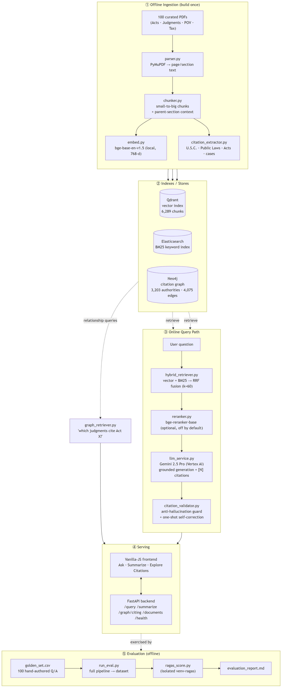
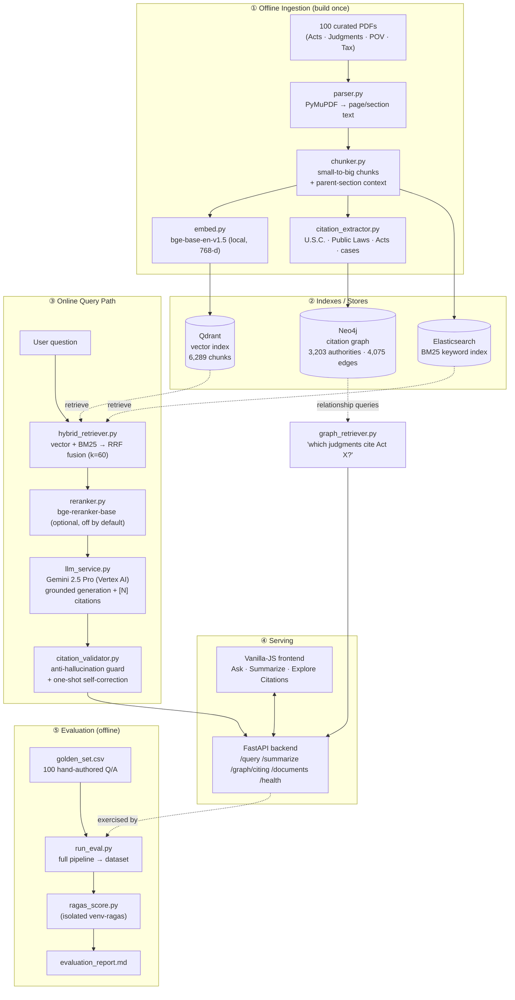
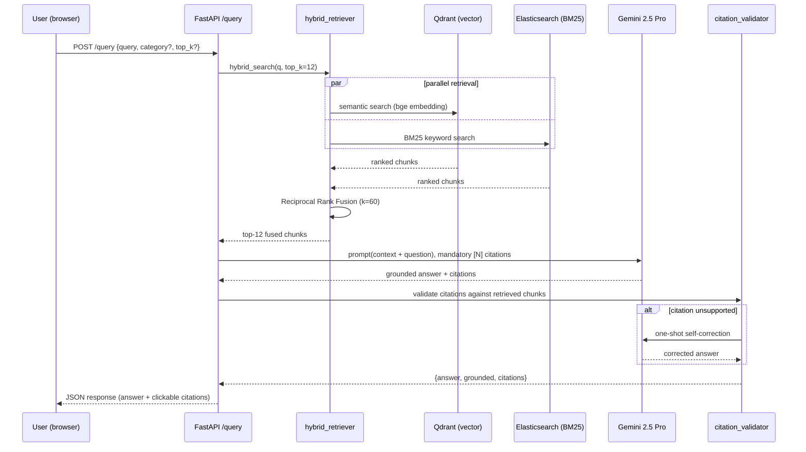

# System Architecture — AI-Powered US Tax & Legal Research System

This document describes the end-to-end architecture: how documents become a
searchable, citable knowledge base, and how a natural-language question becomes
a grounded, cited answer.

---

## 1. High-level diagram

Rendered image above (portable); the interactive Mermaid source is below.

---

## 2. Request lifecycle (an "Ask" query)

---

## 3. Component responsibilities

All pipeline modules live in the `legalrag` package under `src/legalrag/`;
runnable entrypoints live in `scripts/`. Paths below are relative to `src/`.

| Layer | Module(s) | Responsibility |
|---|---|---|
| **Config** | `legalrag/config.py` | Resolves project root + data paths, loads `.env` (one source of truth) |
| **Parsing** | `legalrag/ingestion/parser.py` | PDF → text with page + section tags (PyMuPDF) |
| **Chunking** | `legalrag/ingestion/chunker.py`, `scripts/update_parent_context.py` | Small-to-big chunks; each chunk keeps its parent-section text for context |
| **Embedding** | `legalrag/ingestion/embed.py` | Local `bge-base-en-v1.5` (768-dim), no API cost |
| **Vector index** | `legalrag/indexing/vector_indexer.py`, `scripts/build_vector_index.py` | Upsert chunk vectors into Qdrant |
| **Keyword index** | `legalrag/indexing/es_indexer.py`, `scripts/build_keyword_index.py` | BM25 index in Elasticsearch |
| **Hybrid retrieval** | `legalrag/retrieval/hybrid_retriever.py` | Vector + BM25 → Reciprocal Rank Fusion |
| **Reranking** | `legalrag/retrieval/reranker.py` | `bge-reranker-base` — **off by default** (hurt Top-1 on this corpus) |
| **Generation** | `legalrag/generation/llm_service.py` | Gemini 2.5 Pro, grounded answers with mandatory `[N]` citations |
| **Anti-hallucination** | `legalrag/generation/citation_validator.py` | Validate every citation maps to a retrieved chunk; one-shot self-correction |
| **Graph RAG** | `legalrag/graph/{citation_extractor,graph_builder,graph_retriever}.py` | Neo4j citation graph for relationship queries |
| **API** | `backend/app/main.py` | FastAPI: `/query`, `/summarize`, `/graph/citing`, `/documents`, `/health` |
| **UI** | `frontend/` | Vanilla JS/HTML/CSS: Ask · Summarize · Explore Citations |
| **Evaluation** | `eval/` | Golden set, RAGAS (isolated venv), direct correctness judge |

---

## 4. Key design decisions

- **Hybrid over pure-vector.** Legal text is citation- and term-heavy; BM25 catches
  exact section numbers and statute names that dense vectors blur. RRF fuses both
  rankings without tuning weights.
- **Local embeddings (bge-base-en-v1.5).** Removes API rate limits/cost from the
  ingestion path; `voyage-law-2` was dropped for practical reasons (documented in
  the evaluation report as a future improvement).
- **Vertex AI for generation.** The new `google-genai` SDK on Vertex authenticates
  the service-account key and can spend the $300 GCP credit (AI Studio can't).
  `thinking_budget=0` disables Gemini-2.5 thinking tokens for predictable output.
- **Citation validation as a guard.** Every `[N]` in an answer must resolve to a
  retrieved chunk; unsupported citations trigger one-shot self-correction. This is
  what drives the measured **0% hallucination / 100% grounded** result.
- **Graph RAG for relationships.** "Which judgments cite the Fiscal Responsibility
  Act?" is a graph traversal, not a similarity search — Neo4j answers it directly.
- **RAGAS quarantined in `venv-ragas`.** Its langchain pins conflict with the main
  system; decoupling generation (main venv) from scoring (isolated venv) keeps the
  working system untouched.

---

## 5. Data / infra footprint

| Store | Docker service | Content |
|---|---|---|
| Qdrant | `qdrant` (profile `phase2`) | 6,289 chunk vectors (768-dim) |
| Elasticsearch | `elasticsearch` (profile `phase3`) | BM25 index over the same chunks |
| Neo4j | `neo4j` (profile `phase7`) | 3,203 authority nodes, 4,075 citation edges |

Corpus: **100 native-PDF documents** — 30 Acts / 30 Court Judgments / 30 POV /
10 Tax — page band 15–60.
