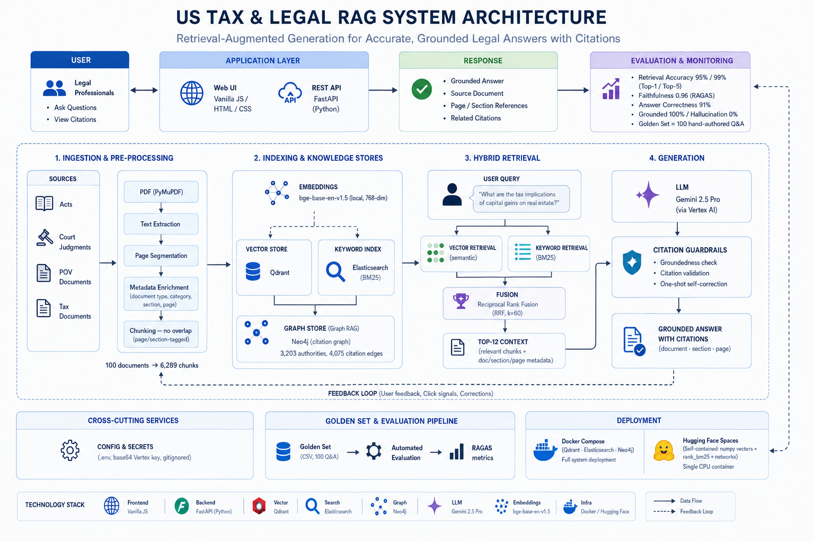

# AI-Powered US Tax & Legal Research System

A production-style **Retrieval-Augmented Generation (RAG)** system for US tax and
legal research. Ask a natural-language question and get a **grounded answer with
exact citations** — document, section, and page — over a curated corpus of 100
US Acts, court judgments, legal commentary, and IRS tax publications.

Built for accuracy and traceability: **0% hallucination / 100% grounded** on a
100-query evaluation (see [evaluation_report.md](evaluation_report.md)).

**🔗 Live demo:** [kuldeepmishra3-legal-rag.hf.space](https://kuldeepmishra3-legal-rag.hf.space) — Ask · Summarize · Explore Citations (Graph RAG).

> **One-page overview:** [SUBMISSION.md](SUBMISSION.md) — capabilities, benchmark results, and how to run it at a glance.

---

## Highlights

- **Hybrid retrieval** — dense vectors (Qdrant) + BM25 keyword (Elasticsearch),
  fused with Reciprocal Rank Fusion. **95% Top-1 / 99% Top-5** retrieval accuracy.
- **Grounded generation** — Gemini 2.5 Pro (Vertex AI) with mandatory `[N]`
  citations and a citation-validation guard + one-shot self-correction.
- **Graph RAG** — Neo4j citation graph answers relationship queries pure search
  can't ("which judgments cite the Fiscal Responsibility Act?"), and surfaces a
  **"related documents"** strip on every answer.
- **Verifiable** — every answer traces to an exact document / section / page.
- **Evaluated** — RAGAS (faithfulness 0.96, context recall 0.98) + a 100-query
  golden set + a direct correctness judge (91% correct / 98% correct-or-partial).

## Architecture



Full request-lifecycle sequence diagram and design rationale in
[ARCHITECTURE.md](ARCHITECTURE.md).

---

## Tech stack

| Concern | Choice |
|---|---|
| Parsing | PyMuPDF (page/section-tagged text) |
| Embeddings | `bge-base-en-v1.5` (local, 768-dim, sentence-transformers) |
| Vector DB | Qdrant |
| Keyword search | Elasticsearch (BM25) |
| Fusion | Reciprocal Rank Fusion (k=60) |
| Reranker | `bge-reranker-base` (optional, off by default) |
| LLM | Gemini 2.5 Pro via Vertex AI (`google-genai` SDK) |
| Graph | Neo4j (Community) citation graph |
| Backend | FastAPI |
| Frontend | Vanilla JS / HTML / CSS |
| Evaluation | RAGAS (isolated venv) + custom golden set |

---

## Prerequisites

- **Python 3.10** (the project venv — **not** system Python 3.13)
- **Docker Desktop** (for Qdrant, Elasticsearch, Neo4j)
- A **Google Cloud project** with the Vertex AI API enabled and a service-account
  key (recommended — uses the $300 credit), *or* an AI Studio API key.

---

## Setup

### 1. Create the venv and install dependencies

```bash
python3.10 -m venv venv
./venv/Scripts/python.exe -m pip install -r requirements.txt   # Windows
# source venv/bin/activate && pip install -r requirements.txt   # macOS/Linux
```

### 2. Configure credentials

```bash
cp .env.example .env
```

Edit `.env` and set the Gemini auth (see the file's inline comments):

- **Vertex AI (recommended):** `GEMINI_USE_VERTEX=true`, `GCP_PROJECT=...`,
  `GOOGLE_APPLICATION_CREDENTIALS=.../vertex-key.json`
- **AI Studio (simpler):** `GEMINI_USE_VERTEX=false`, `GOOGLE_API_KEY=...`

`GEMINI_MODEL` defaults to `gemini-2.5-pro`. Neither `.env` nor `vertex-key.json`
is committed (both are gitignored).

### 3. Start the backing services

```bash
docker compose --profile phase2 --profile phase3 --profile phase7 up -d
# or everything at once:
docker compose --profile all up -d
```

This starts Qdrant (6333), Elasticsearch (9200), and Neo4j (7687).

### 4. Build the indexes (one-time)

```bash
./venv/Scripts/python.exe scripts/build_processed.py      # parse + chunk PDFs → processed/
./venv/Scripts/python.exe scripts/build_vector_index.py    # embed → Qdrant
./venv/Scripts/python.exe scripts/build_keyword_index.py   # BM25 → Elasticsearch
./venv/Scripts/python.exe -m legalrag.graph.graph_builder  # citations → Neo4j
```

---

## Run the app

```bash
./venv/Scripts/python.exe -m uvicorn backend.app.main:app --reload --port 8000
```

Open **http://localhost:8000** — three tabs:

- **Ask** — grounded Q&A with clickable citations
- **Summarize** — document-level summaries
- **Explore Citations** — Graph RAG relationship queries

Check system health at **http://localhost:8000/health**.

---

## API reference

| Method | Endpoint | Purpose |
|---|---|---|
| `GET` | `/health` | Per-service reachability + model id |
| `POST` | `/query` | Grounded Q&A. Body: `{query, category?, top_k?}` |
| `POST` | `/summarize` | Document summary. Body: `{doc_id}` |
| `POST` | `/graph/citing` | Graph RAG. Body: `{reference, category?}` |
| `GET` | `/documents` | List corpus documents |

**Example:**

```bash
curl -X POST http://localhost:8000/query \
  -H "Content-Type: application/json" \
  -d '{"query": "What is the standard deduction for a single filer?"}'
```

Response: `{query, answer, grounded, citations:[{marker, doc, section, page, url}], related_documents:[…], shared_authorities:[…], model}`

---

## Testing

Full regression across all 8 build phases (**63 tests**):

```bash
./venv/Scripts/python.exe -m pytest tests/ -q
```

Per-phase gates live in `tests/test_phase1_parsing.py` … `test_phase8_eval.py`.

---

## Evaluation

The system is evaluated end-to-end on a hand-authored **100-query golden set**
(`eval/golden_set.csv`, 25 per category):

```bash
./venv/Scripts/python.exe eval/run_eval.py                 # run pipeline → eval_dataset.jsonl
./venv-ragas/Scripts/python.exe eval/ragas_score.py         # RAGAS scoring (isolated venv)
./venv/Scripts/python.exe eval/judge_correctness.py         # direct correctness judge
```

| Metric | Score |
|---|---|
| Retrieval Accuracy (Top-1 / Top-5) | 95% / 99% |
| Faithfulness (RAGAS) | 0.96 |
| Context Recall (RAGAS) | 0.98 |
| Answer Correctness | 91% correct / 98% correct-or-partial |
| Grounded / Hallucinated | 100% / 0% |

Full analysis, methodology, and limitations: **[evaluation_report.md](evaluation_report.md)**.

RAGAS runs in a separate `venv-ragas` (pinned in `requirements-ragas.txt`) because
its langchain dependencies conflict with the main system — the working system is
never touched by evaluation dependencies.

---

## Deployment (Hugging Face Spaces)

A self-contained, server-less variant lives in [deploy/huggingface/](deploy/huggingface/)
— it runs the whole system in a single free CPU container by replacing the three
servers with in-process equivalents (numpy exact-cosine vectors, `rank_bm25`,
`networkx` graph), while **reusing the generation pipeline verbatim**. Measured on
the 100-query golden set, it holds answer quality exactly (**91%/98% correctness,
100% grounded**, retrieval Top-5 99%); Graph RAG is preserved with verified exact
parity. See [deploy/huggingface/DEPLOY.md](deploy/huggingface/DEPLOY.md) for the
push guide (needs a Vertex service-account secret).

---

## Project structure

```
data/
├── pyproject.toml               packaging — `pip install -e .` makes legalrag importable
├── src/legalrag/                the pipeline package (src layout)
│   ├── config.py                one place resolves paths + loads .env
│   ├── ingestion/               parser, chunker, embed
│   ├── indexing/                vector_indexer, es_indexer
│   ├── retrieval/               hybrid_retriever, reranker
│   ├── generation/              llm_service, citation_validator
│   └── graph/                   citation_extractor, graph_builder, graph_retriever
├── scripts/                     entrypoints (build_processed, build_*_index, backup, evaluate_*)
├── backend/app/main.py          FastAPI backend
├── frontend/                    Vanilla-JS UI (index.html, app.js, style.css)
├── deploy/huggingface/          self-contained HF Space (server-less variant)
├── dataset/                     100 source PDFs (acts/ judgments/ pov/ tax/)
├── processed/                   parsed + chunked corpus
├── eval/                        golden set, harness, RAGAS, reports
├── tests/                       per-phase test gates (63 tests)
├── docs/                        prd, plan, task, architecture.png
├── docker-compose.yml           Qdrant · Elasticsearch · Neo4j
├── requirements.txt             main deps
├── requirements-ragas.txt       isolated eval deps
├── SUBMISSION.md                deliverables map (start here if grading)
├── ARCHITECTURE.md              system diagram + design
└── evaluation_report.md         full evaluation
```

---

## Notes & limitations

- **Tax retrieval** is the soft spot (84% Top-1, 100% Top-5) — IRS pubs share heavy
  vocabulary. A legal-domain embedding model would likely lift this.
- **Multi-year corpus** (2025 + 2026 tax years) — year-agnostic questions can
  surface both years' figures.
- Reranker is off by default because it hurt Top-1 on this corpus.

See `evaluation_report.md` §7 for the full observations, limitations, and
prioritized improvements.
